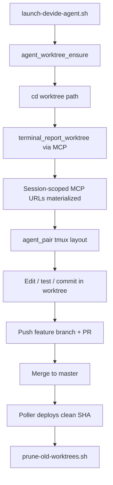

# Development workflow for Casein

**Status**: Draft v0.1 — 2026-06-24  
**Audience**: Human developers + AI agents operating in this repository  
**Related docs**: `AGENTS.md`, `CLAUDE.md`, [`agent_concurrency.md`](agent_concurrency.md), [`in-progress.md`](in-progress.md)

---

## Core principles

1. **Primary checkout is deploy infrastructure, not the default edit surface.**
   `/data/workspaces/dalexandre/dev_ide` (and equivalents) exists to fetch remotes,
   run the deploy poller (`/opt/devide/deploy-build`), and materialize MCP configs.
   **Rule**: no uncommitted edits; no agent or human should use it as `$PWD` during
   active work.

2. **Every agent session lives in a dedicated, reported git worktree.**
   One worktree per task/agent/session. The path is recorded via
   `terminal_report_worktree` at launch (wired in `scripts/launch-devide-agent.sh`).
   Worktrees are short-lived: created from `origin/master` (or a named base ref) and
   pruned within 24h of merge or explicit close.

3. **Isolation is enforced at launch, not opt-in discipline.**
   `launch-devide-agent.sh` creates a worktree when the agent would otherwise start
   in the primary checkout. Set `DEVIDE_AGENT_SKIP_WORKTREE=1` only for deliberate
   exceptions. `Runtimes.observe_worktree/2` rejects the main checkout
   (`:main_checkout_not_allowed`).

4. **`master` moves in small, rebased increments.**
   Long-lived integration branches are an anti-pattern. Prefer stacked, frequently
   rebased PRs. Track active subsystems in [`in-progress.md`](in-progress.md).

5. **Deployment is tiered and observable.**
   Agents dogfood against worktree-local releases (`deploy-local.sh`). `master`
   pushes are built from a clean detached worktree by `deploy-poller.sh`, which
   runs `pre-push-check.sh` (including `mix precommit.ci`) before activation.
   Drift between deployed SHA and `origin/master` surfaces in the UI banner.

6. **Meta-dogfooding is mandatory.**
   DevIDE tracks agent worktrees in `Runtimes`. Launch scripts must create and
   report them — if the tool cannot enforce its own rules, the rules are not real.

---

## 1. Worktree discipline (source control)

### Primary checkout rules

| Location | Role | Allowed edits? | Agent default `$PWD`? |
|----------|------|----------------|----------------------|
| `/data/workspaces/.../dev_ide` | Fetch, poller base, MCP materialization | No | Never |
| `$TMPDIR/devide-agent-worktrees/` | All development, tests, commits | Yes | Always |

### Enforcement at launch

`scripts/launch-devide-agent.sh` calls `scripts/lib/agent-worktree.sh` after
resolving agent env:

1. Skip when `DEVIDE_AGENT_SKIP_WORKTREE=1`.
2. Reuse `DEVIDE_AGENT_WORKTREE_PATH` when set.
3. Reuse the current directory when already inside a linked worktree.
4. Otherwise create `agent/<runtime>/<task>-<timestamp>` under the worktree root,
   `cd` there, and call `terminal_report_worktree` over the session-scoped MCP URL.

Environment knobs:

| Variable | Default | Purpose |
|----------|---------|---------|
| `DEVIDE_AGENT_WORKTREE_ROOT` | `$TMPDIR/devide-agent-worktrees` | Worktree parent directory |
| `DEVIDE_AGENT_WORKTREE_BASE` | `origin/master` | Base ref for new worktrees |
| `DEVIDE_AGENT_TASK` | `adhoc` | Task slug in branch name |
| `DEVIDE_AGENT_SKIP_WORKTREE` | `0` | Set `1` to opt out (escape hatch) |

### Worktree janitor

```bash
# Dry-run first
bash scripts/prune-old-worktrees.sh --dry-run

# Nightly default: remove worktrees older than 1 day
bash scripts/prune-old-worktrees.sh

# Custom retention
bash scripts/prune-old-worktrees.sh --days 3
```

Also run `git worktree prune` on the primary repo (the script does this automatically).

### Read-only `master` in the primary checkout

Local `master` in `/data/workspaces/.../dev_ide` is a **read-only mirror** of
`origin/master`. Land work on agent-worktree branches, then integrate via PR or
fast-forward push. `.githooks/pre-commit` refuses `git commit` on `master` in
the primary checkout (linked agent worktrees are exempt). Enable with
`git config core.hooksPath .githooks`.

### Pathspec-only commits

Never `git commit -a` from the primary checkout. Stage and commit explicit paths:

```bash
git add lib/casein/my_file.ex test/casein/my_file_test.exs
git commit -- lib/casein/my_file.ex test/casein/my_file_test.exs
```

Verify claims against `HEAD`, not the working tree — see [`agent_concurrency.md`](agent_concurrency.md).

### Direction-of-record

While a subsystem is under active development, add an entry to
[`in-progress.md`](in-progress.md). Other agents treat listed paths as read-only
until the entry is removed.

---

## 2. Branching and integration

**Anti-pattern**: `merge-agent-worktree-sessions` (weeks old, diverged from
`origin/master`, carrying preview-proxy + worktree-lifecycle + recording work in
one branch).

**Target model**:

```
master (protected; green pre-push gate)
├── feat/worktree-session-mcp       (land first)
├── feat/worktree-preview-launch    (rebased after above)
├── feat/preview-recordings         (rebased after above)
└── hotfix/SEC-1-token-scoping      (urgent, small)
```

### Immediate rebase plan (current dirty branch)

1. `git fetch origin`
2. `git rebase origin/master` on `merge-agent-worktree-sessions`
3. `git worktree add /tmp/devide-rebase-$(date +%s) merge-agent-worktree-sessions`
4. Split WIP: worktree-session core in one PR; preview recordings in a follow-up
5. Mark frozen paths in [`in-progress.md`](in-progress.md) until merge
6. Delete the long-lived branch and its worktree after merge

**Daily habit**: rebase active feature branches onto `origin/master` before coding.

---

## 3. Deployment tiers

| Tier | Trigger | Serves | Gate |
|------|---------|--------|------|
| **Stable** | Push to `master` (poller) | Production `devide` socket | Clean detached worktree + `pre-push-check.sh` |
| **Agent dev** | `deploy-local.sh` from worktree | Ephemeral release | Full `git rev-parse HEAD` pinned; drift banner until pushed |
| **Canary** (future) | Push to `master` | Second socket / instance | Same gate + soak before promote |

**Today**

- Poller already builds from `/opt/devide/deploy-build` at the target SHA and runs
  the full pre-push gate before packaging — a `--no-verify` push cannot activate
  until that worktree gate passes.
- `deploy-local.sh` deploys the **current checkout** immediately; the poller
  replaces it within ~2 min when `origin/master` advances. Use only for dogfooding;
  commit + push for durable deploys.
- Non-SHA `DEVIDE_GIT_REVISION` values (manual labels) trigger the drift banner via
  `DevIDE.Deployment.Drift`.

**Future**

- Restore GitHub Actions as an off-box syntax gate for contributors without local
  hooks.
- Optional canary socket with explicit promote step.

---

## 4. Session lifecycle



**Exit protocol (required)**

Before ending a session, every agent must leave an explicit handoff — see
`AGENTS.md` § "Agent session exit protocol". The daily worktree-alarm sweep
(`scripts/devide-worktree-alarm-sweep.sh`, timer via
`scripts/ensure-devide-worktree-alarm-sweep.sh`) turns "dirty worktree, no
report, no process, >24h" into `workspace.agent_worktree_stale` audit events
instead of silent archaeology.

**Gaps still open**

1. UI banner when an agent cwd is the primary checkout (Runtimes already rejects it).
2. Land worktree-session MCP scoping before stacking preview recordings.
3. Surface worktree-alarm + prune events prominently in the Agents panel.

---

## 5. Security: workspace-scoped MCP calls

Workspace-scoped tokens are enforced for external agent tool calls. Global tokens
may initialize MCP and list tools, but terminal and preview `tools/call` requests
must use a workspace-scoped token so mutations resolve through the workspace
authorization boundary.

---

## 6. Elixir toolchain

Three pins exist on purpose today (local 1.20, release 1.19, CI 1.18) — see
`AGENTS.md`. Agents must use `mise exec -- mix ...` from the checkout (`.tool-versions`
pins the local toolchain). Converge versions when convenient; any bump must touch
`Dockerfile`, `.github/workflows/*.yml`, `.tool-versions`, and `AGENTS.md`.

---

## Roadmap

| # | Item | Impact | Effort | Status |
|---|------|--------|--------|--------|
| 1 | Rebase + land worktree sessions (split recordings) | High | Medium | In progress |
| 2 | SEC-1 workspace-scoped MCP tokens | Critical | Medium | **Done** |
| 3 | Auto-worktree in `launch-devide-agent.sh` | Highest daily leverage | Low | **Done** (this doc) |
| 4 | Worktree janitor script | Medium | Low | **Done** (cron wiring TBD) |
| 4b | Stale worktree alarm sweep + exit protocol | High | Low | **Done** (timer via `ensure-devide-worktree-alarm-sweep.sh`) |
| 5 | Canary vs stable deploy tiers | Medium | Medium | Partial (poller gate exists) |
| 6 | Converge Elixir versions | Low | Low | Not started |
| 7 | `in-progress.md` subsystem freeze | Medium | Very low | **Done** |

---

## How to use this document

- **Humans**: read before starting work; launch agents via `launch-devide-agent.sh`,
  not by `cd`ing into the primary checkout.
- **Agents**: treat every **Rule** and **MUST** as executable specification. Refuse
  actions that violate them and surface the violation.
- **When rules feel painful**: improve tooling (scripts, hooks, error messages) rather
  than weakening the rules.
