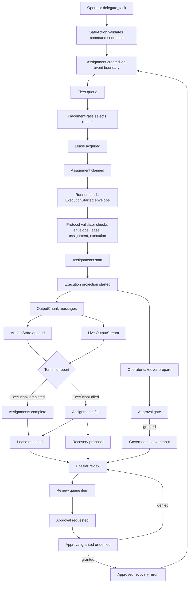

# Operator Lifecycle: Delegated Execution

This is the operator-facing trace for a delegated task. It uses the runtime
vocabulary consistently:

| Term | Meaning |
|---|---|
| Assignment | Durable orchestration intent for one approved unit of work. |
| Execution | One concrete runner attempt for an assignment. |
| Workspace | The validated worktree/runtime target. |
| Session | tmux-backed operator attachment surface for a live execution. |
| Dossier | Reviewable evidence bundle assembled from assignments, executions, commands, artifacts, audit, and recovery actions. |

## Full Trace

1. **Delegate**
   - Operator calls `DevIDE.Fleet.delegate_task/3` with a workspace id and a list of command ids.
   - Every command id is prevalidated through `DevIDE.Runners.SafeAction`.
   - Raw argv and shell strings are rejected before any assignment is created.
   - Audit records `fleet.delegate_task.created`.

2. **Place**
   - Each command creates one assignment through `DevIDE.Assignments.create/1`.
   - Placement requirements come from the safe action capability list.
   - `DevIDE.Fleet.Queue` holds the assignment until an eligible runner exists.

3. **Lease**
   - `DevIDE.Fleet.PlacementPass` selects an eligible runner.
   - `DevIDE.Fleet.Registry.acquire_lease/3` binds the runner to the assignment.
   - The assignment is claimed through the assignment event boundary.

4. **Execute**
   - The runner reports `ExecutionStarted` in a protocol envelope.
   - The controller validates envelope, message shape, lease, assignment scope, and execution sequence.
   - `DevIDE.Fleet.LocalRunnerAdapter` updates assignment state only through `DevIDE.Assignments.start/1`.
   - `DevIDE.Fleet.ExecutionProjectionStore` records the execution cache for live observation.

5. **Stream**
   - Output arrives as `OutputChunk` messages.
   - Output is observational: it requires an active execution but never mutates assignment state.
   - The durable artifact store is written before the live output stream.

6. **Artifact**
   - `DevIDE.Fleet.ArtifactStore.RepoAdapter` appends chunks to `fleet_artifact_chunks`.
   - Chunks are ordered by monotonic per-execution sequence.
   - Existing chunks are not updated by append operations.

7. **Complete or Fail**
   - The runner reports `ExecutionCompleted` or `ExecutionFailed`.
   - The controller requires the execution to be active and bound to the same lease.
   - Assignment terminal state changes only through `DevIDE.Assignments.complete/1` or `DevIDE.Assignments.fail/2`.
   - The fleet lease is released after terminal transition.

8. **Recover or Take Over**
   - Recovery proposals are read-first and stale-checked at apply time.
   - Retry, requeue, and clone create new assignments; originals are untouched.
   - Takeover preparation is read-only.
   - Takeover keystrokes default to governed safe-command input. Raw mode is separately policy-gated.

9. **Review Dossier**
   - `DevIDE.Fleet.dossier/2` returns workspace identity, assignment history, command history, execution trail, artifacts, failures, and recovery actions.
   - Each execution trail entry includes `assignment_id`, `execution_id`, `runner_id`, `workspace_id`, `lease_id`, command, exit status, artifacts, and recovery actions.

10. **Review Queue**
    - `DevIDE.Fleet.review_queue/2` surfaces completed and failed delegated executions that need human review.
    - Each review item links back to the dossier by workspace, assignment, and execution.
    - Review items include artifacts, exit status, exit code, command, runner, lease, and recovery options.

11. **Approve Risky Actions**
    - `DevIDE.Fleet.request_approval/3` records a requested approval in the run ledger.
    - `DevIDE.Fleet.grant_approval/2` and `DevIDE.Fleet.deny_approval/2` record the decision.
    - Risky retry/recovery and takeover input require a granted approval that matches the action and assignment.
    - Approval decisions are included in `DevIDE.Fleet.dossier/2`.

12. **Runbook Actions**
    - `DevIDE.Fleet.runbook_actions/0` exposes reusable operator actions:
      `rerun_tests`, `rerun_precommit`, `rebuild_assets`, `inspect_dossier`, and `attach_session`.
    - Command runbook actions execute through `DevIDE.Fleet.run_safe_command/3`.
    - `inspect_dossier` is read-only.
    - `attach_session` is gated by approval and then calls takeover preparation.

13. **Notify Operators**
    - `DevIDE.Fleet.OperatorNotifications` emits best-effort notifications for completed, failed, stale, and recovered executions.
    - Notifications are post-commit and non-authoritative. The assignment event stream, execution projections, artifact store, audit log, and dossier remain the sources of truth.

## Operator Demo Flow

The first end-to-end operator workflow is:

1. `DevIDE.Fleet.delegate_task(workspace_id, ["compile"], task_id: task_id)`
2. The runner executes the delegated command and reports failure.
3. `DevIDE.Fleet.review_queue(workspace_id)` returns the failed delegated execution with artifacts and retry recovery proposal.
4. `DevIDE.Fleet.request_approval(:retry_assignment, %{type: "assignment", ref: assignment_id, workspace_id: workspace_id})`
5. `DevIDE.Fleet.grant_approval(approval_id)`
6. `DevIDE.Fleet.apply_approved_recovery(proposal, approval_id, operator_id, rerun: true)`
7. The rerun executes through the same safe command, placement, lease, protocol, artifact, and terminal boundaries.
8. The dossier shows both executions, approval decisions, artifacts, and recovery audit evidence.
9. Operator notifications include failed, completed, and recovered events.

## Remote Runner Substrate

M61-M80 extends the same lifecycle across real runner processes. The operator
entrypoints are:

```bash
mix jx.runner.start --endpoint http://localhost:4000 --token "$DEV_IDE_RUNNER_TOKEN"
mix jx.attach <execution_id>
mix jx.dossier.export <assignment_id> --output tmp/dossier.json
bash scripts/dogfood_remote_fleet.sh
```

The runner process registers identity, heartbeats, renews leases, polls or
subscribes for assignments, validates protocol envelopes, uploads artifacts,
and reports terminal status. Attach/reconnect is replay-first: durable output
is read before the live stream topic is subscribed.

See [`remote_execution_substrate.md`](remote_execution_substrate.md) for the
full M61-M80 transport, identity, tmux, scheduler, dashboard, dogfood, and
replay trace.

## Mermaid Flow



## Boundary Rules

- Mutation of assignment state happens only through `DevIDE.Assignments`.
- Mutation of fleet lease state happens only through `DevIDE.Fleet.Registry`.
- Execution projections are cache records, not authority.
- Output and artifacts are observational and append-only.
- Takeover cannot be used as a default raw shell escape hatch.
- Takeover input, retry, and recovery actions require matching granted approvals.
- Runbook command actions execute through safe command ids, not raw argv.
- Operator notifications are not state; they are post-commit hints.
- The dossier reads evidence; it does not repair, replay, or mutate state.
