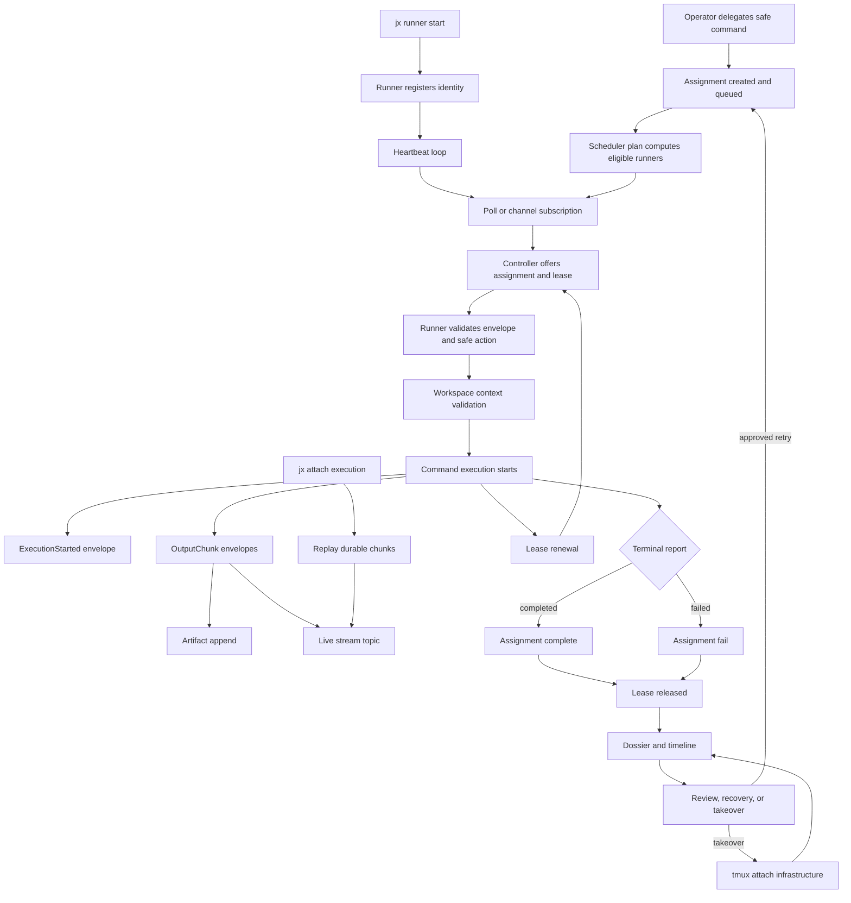

# Remote Execution Substrate

This document covers M61-M80: the transition from a single-node delegated
execution loop to a dogfoodable multi-runner operational substrate.

The core rule stays unchanged:

> tmux, SSH, channels, and runner processes are infrastructure. The
> orchestration truth is the assignment event stream, fleet lease registry,
> protocol envelopes, artifact store, audit log, and dossier.

## Components

| Component | Role |
|---|---|
| `DevIDE.Fleet.RemoteRunner` | Standalone runner process with registration, heartbeat, lease renewal, polling, execution, artifact upload, and terminal reporting. |
| `mix jx.runner.start` | Local operator entrypoint for starting a runner process against a controller. |
| `DevIDE.Fleet.RemoteRunner.HttpTransport` | Req-backed HTTP transport for localhost or remote controller communication. |
| `DevIdeWeb.FleetRunnerChannel` | Phoenix Channel transport for controller-runner messages with protocol version negotiation and resume hooks. |
| `DevIDE.Fleet.RunnerDirectory` | Durable runner identity and trust-state directory. |
| `DevIDE.Fleet.ExecutionBackend.SshTmux` | SSH/tmux infrastructure adapter for worktree/session attachment. |
| `DevIDE.Fleet.Attach` | Replay plus live-subscribe packet for terminal-native execution attach. |
| `mix jx.dossier.export` | Operator export command for one complete assignment evidence bundle. |
| `DevIDE.Fleet.Scheduler` | Read-only scheduling plan for queues, pools, concurrency groups, and affinity. |
| `DevIDE.Fleet.ExecutionTimeline` | Replay inspection view for one execution or assignment. |

## Starting a Runner

Localhost first:

```bash
mix phx.server
mix jx.runner.start --endpoint http://localhost:4000 --token "$DEV_IDE_API_TOKEN"
```

The runner process:

1. Registers identity and capability manifest.
2. Starts a heartbeat loop.
3. Polls or subscribes for assignment offers.
4. Validates protocol envelopes.
5. Executes only approved `SafeAction` commands.
6. Uploads output and artifacts through protocol messages.
7. Renews the active lease while work is still running.
8. Reports terminal success or failure.

The runner never creates assignments and never becomes authoritative for
assignment state.

## Channel Transport

The runner channel is mounted at `/fleet_runner`.

Channel topic:

```text
runner:<runner_id>
```

Join payload:

```json
{
  "protocol_version": 1
}
```

Join reply:

```json
{
  "transport": "devide.fleet.channel.v1",
  "protocol_version": 1,
  "runner_id": "<runner_id>",
  "resumable": true
}
```

The channel handles:

| Event | Direction | Meaning |
|---|---|---|
| `poll_offer` | runner -> controller | Ask for one compatible assignment offer. |
| `message` | runner -> controller | Submit a serialized protocol envelope. |
| `heartbeat` | runner -> controller | Refresh runner liveness. |
| `resume` | runner -> controller | Read execution/artifact history for a runner-owned assignment. |

Unsupported protocol versions are rejected at join. Message envelopes are
deserialized and checked against the joined runner id before entering
`DevIDE.Fleet.Protocol.send_to_controller/1`.

## Runner Identity

Runner identity is first-class operational state:

| Trust state | Meaning |
|---|---|
| `authorized` | Runner may receive work when placement rules match. |
| `draining` | Runner remains visible but is excluded from new placement. |
| `maintenance` | Runner is intentionally held out of placement. |
| `revoked` | Runner cannot register again with the same id. |

Identity records include hostname, capabilities, manifest, metadata,
registered time, updated time, and revocation time. Trust-state transitions are
audited as `fleet.runner_identity.*` events under the fleet audit scope.

## Runner Lifecycle

Operators can remove a runner from placement without revoking its identity:

| Operation | Effect |
|---|---|
| `drain` | Trust state becomes `draining`; the runner stays visible but does not receive new work. |
| `shutdown` | Runner is drained, marked offline, and its final identity/runner state remains inspectable. |
| `revoke` | Runner identity becomes `revoked`; register, heartbeat, poll, and reconnect are rejected. |

HTTP transport exposes lifecycle calls at:

| Method | Path |
|---|---|
| `POST` | `/api/fleet/v1/runners/:runner_id/drain` |
| `POST` | `/api/fleet/v1/runners/:runner_id/shutdown` |

`DevIDE.Fleet.RemoteRunner.shutdown/2` drains first, waits for an active task
to finish, reports shutdown to the controller, and then stops the runner
process.

## Runner Auth and Trust

Runner transport uses bearer tokens, but runners should not use the broad
operator API token in dogfood or production.

| Token | Scope |
|---|---|
| `DEV_IDE_API_TOKEN` | Operator/API token. Can call general API routes. |
| `DEV_IDE_RUNNER_TOKEN` | Runner transport token. Accepted only by `/api/fleet/v1/*` and the runner channel. |

If a dedicated runner token is not configured, DevIDE still accepts the API
token on runner transport routes for local development compatibility. The
dogfood path should set both tokens and pass only `DEV_IDE_RUNNER_TOKEN` to
`mix jx.runner.start`.

Trust state is enforced separately from bearer auth:

1. A revoked identity cannot register again.
2. A revoked identity cannot heartbeat.
3. A revoked identity cannot poll for work.
4. A revoked identity cannot reconnect to the Phoenix Channel.

Bearer auth answers "may this transport connect?" Runner trust answers "may
this runner identity participate?"

## SSH/tmux Backend

`DevIDE.Fleet.ExecutionBackend.SshTmux` prepares workspace metadata and returns
tmux session handles:

1. Validate the workspace through `DevIDE.Fleet.WorkspaceContext`.
2. Resolve observed branch and git metadata from the workspace cache.
3. Create or attach to a tmux session through the tmux adapter.
4. Return attach commands and historical artifact chunks.

The backend does not mutate assignment state. It does not complete or fail
executions. It only supplies infrastructure handles for operator attachment and
resumption.

## Boundary Audit

M71 production-safety audit:

| Boundary | Enforcement |
|---|---|
| Runner/controller authority split | Runner-origin transport only accepts runner messages: execution state, output/artifacts, telemetry, heartbeat, and lease renewal. Controller instructions such as `AssignmentOffered` and `AssignmentRevoked` are rejected if sent back through runner transport. |
| Orchestration mutation | Runner reports enter `DevIDE.Fleet.Protocol.send_to_controller/1`; assignment state changes still pass through `DevIDE.Assignments`. Output/artifact messages cannot start, complete, fail, or recover assignments. |
| Versioned protocol | Every transport payload is deserialized from `Protocol.Envelope`, checks protocol version `1`, validates UUIDs/timestamps/message shape, validates lease ownership/expiry, and validates execution sequence before dispatch. |
| SSH/tmux | `ExecutionBackend.SshTmux` returns workspace/session/attach metadata and historical chunks only. It does not write assignments, leases, recovery state, or artifacts. |
| Unsafe commands | The runner executor resolves `safe_action_id` through `DevIDE.Runners.SafeAction`; runner transport cannot introduce raw argv or spoof a controller offer. |
| Secret handling | Dedicated runner tokens are supported, token comparison is constant-time, runner tokens are not accepted on general API routes, and output chunks redact obvious token/password/bearer material before durable storage and live broadcast. |

## Attach and Replay

Terminal-native attach is read-first:

```bash
mix jx.attach <execution_id>
```

Attach packets include:

| Field | Meaning |
|---|---|
| `execution` | Execution projection for the selected execution id. |
| `historical_chunks` | Durable artifact/output chunks in order. |
| `live_topic` | PubSub topic for live output after replay. |
| `dossier` | Current evidence bundle for the execution workspace and assignment. |

The attach path subscribes to live chunks only after replay state is built. A
disconnect can reconnect by requesting the same packet again.

## Dossier Export

Export one complete assignment evidence bundle:

```bash
mix jx.dossier.export <assignment_id> --output tmp/dossier.json
```

The bundle includes assignment, assignment events, executions, runner identity,
workspace, artifacts, recovery actions, timeline entries, and the current
runtime dossier view. Empty artifact lists are still present for quiet
successful commands.

## Operator Diagnostics

The fleet UI has two operator surfaces:

| Surface | Purpose |
|---|---|
| `/fleet` | Read-only fleet overview: scheduler plan, runner pool state, runner identities, leases, and notifications. |
| `/fleet/runners/:id` | Runner detail: identity state, last heartbeat, active leases, current execution, recent failures, execution links, assignment links, and dossier anchors. |

The runner detail page links the diagnostic path in both directions:

```text
runner -> assignment -> execution -> dossier
```

The page is intentionally read-only. Recovery and takeover remain in the
assignment/operator workflow surfaces with their approval gates.

## Scheduling

Scheduling is explicit but read-only:

| Input | Behavior |
|---|---|
| Runner pool | Assignment may target a named pool via metadata or `pool:<name>` capability. |
| Workspace affinity | Preferred runners sort first when they advertise matching workspace affinity. |
| Concurrency group | Active leases are counted by group and compared with the assignment limit. |
| Priority | Queue ordering remains high, normal, low with FIFO inside each band. |
| Draining/maintenance | Runners in either state are visible but ineligible for new work. |

The `/fleet` dashboard shows the scheduler plan, runner identities, active
leases, and recent operator notifications. It is an inspection surface, not a
mutation authority.

## Lifecycle Trace

One full remote lifecycle:

1. Operator delegates a safe command for a workspace.
2. Assignment is created and queued with placement requirements.
3. A runner starts with `mix jx.runner.start`.
4. Runner registers identity and heartbeat.
5. Scheduler sees the runner as eligible by capability, pool, concurrency, and affinity.
6. Runner polls or subscribes over HTTP/channel transport.
7. Controller returns an `AssignmentOffered` envelope and lease.
8. Runner validates the envelope and resolves the safe action.
9. Runner validates workspace context.
10. Runner starts command execution.
11. Runner reports `ExecutionStarted`.
12. Output chunks are appended to durable artifacts and broadcast live.
13. Operator may run `mix jx.attach <execution_id>` to replay durable output and subscribe to live chunks.
14. Runner renews the lease while work remains active.
15. Runner reports `ExecutionCompleted` or `ExecutionFailed`.
16. Controller releases the lease after terminal assignment transition.
17. Dossier includes assignment id, execution id, runner id, workspace id, lease id, command, exit status, artifacts, and recovery actions.
18. Scheduler may place follow-up work, or a human may review and approve retry, recovery, or takeover.
19. Takeover attaches to tmux infrastructure, but assignment truth remains in the event/protocol stores.

## Dogfood Demo Script

The local dogfood flow is scripted in
[`../scripts/dogfood_remote_fleet.sh`](../scripts/dogfood_remote_fleet.sh).

It starts two long-running OS processes:

1. controller: `elixir --sname devide_controller --cookie ... -S mix phx.server`
2. runner: `elixir --sname devide_runner --cookie ... -S mix jx.runner.start`

Then it uses short operator RPC processes to seed the workspace, create one
successful safe fleet assignment, create one deterministic failing assignment,
enqueue both for the standalone runner, wait for execution projections, replay
attach packets, verify recovery approval gating, and export dossier bundles.

Run it with:

```bash
WORKSPACE_ID=<workspace-id> \
WORKSPACE_PATH="$PWD" \
COMMAND_ID=format \
FAIL_COMMAND_ID=dogfood.fail \
bash scripts/dogfood_remote_fleet.sh
```

The script writes:

| File | Meaning |
|---|---|
| `summary.json` | Workspace, assignment ids, execution ids, terminal states, and dossier paths. |
| `attach-success.json` | Replay packet summary for the successful execution. |
| `attach-failure.json` | Replay packet summary for the failed execution. |
| `recovery-gate.json` | Proof that recovery apply is denied without approval, then approval is requested. |
| `dossier-success.json` | Complete exported dossier for the successful assignment. |
| `dossier-failure.json` | Complete exported dossier for the failed assignment and recovery proposal. |

The M76 dogfood run exposed five operator-friction defects that were fixed:

1. Controller port and migration setup are now handled by the script.
2. Workspace seeding is explicit before delegation.
3. Runner hostname defaults survive omitted CLI options.
4. Runner command execution now reports erlexec exits and resolves safe-action
   executables from `PATH` without a shell.
5. Operator RPC helpers quiet controller debug logs so the demo output shows
   assignment ids, execution ids, terminal states, recovery gating, and dossier
   paths without Ecto query noise.

The final M76-M80 run was:

```bash
WORKSPACE_ID=dev_ide \
WORKSPACE_PATH=/Users/developer/Documents/GitHub/workspaces/milc/dev/dev_ide \
COMMAND_ID=format \
FAIL_COMMAND_ID=dogfood.fail \
PHX_PORT=4177 \
LOG_DIR=tmp/dogfood_m76_final_current \
bash scripts/dogfood_remote_fleet.sh
```

Observed evidence:

| Leg | Assignment | Execution | State | Evidence |
|---|---|---|---|---|
| Success | `c5cb885f-ca38-4da4-83c9-cfbaaeea8889` | `4d8ade0e-9691-4694-8640-15bffbfc51b5` | `completed` | `tmp/dogfood_m76_final_current/dossier-success.json` |
| Failure | `15b542da-3302-4f9b-ac31-61f8e3e65707` | `15f3a333-e36c-46b1-b517-a840817a5823` | `failed` | `tmp/dogfood_m76_final_current/dossier-failure.json` |

`recovery-gate.json` recorded `{:error, :approval_required}` before creating
approval `b761ba70-362b-4701-92ea-00de5f933bcb`.

This smoke test deliberately uses `DEV_IDE_RUNNER_TOKEN` for the runner process
and keeps `DEV_IDE_API_TOKEN` on the controller/operator side.

## Mermaid Flow



## Safety Checks

- Unsafe commands are still rejected before assignment creation or execution.
- Stale leases are rejected by protocol validation.
- Invalid or revoked runners cannot receive work.
- Takeover input remains approval-gated.
- Artifact writes are append-only.
- Artifact uploads after lease expiry are rejected.
- Duplicate terminal reports are rejected after lease release.
- Recovery proposals are stale-checked before apply.
- Runner output cannot mutate orchestration state.
- Runner output is redacted for obvious credential patterns before storage and live broadcast.
- Channel and HTTP transports only carry versioned protocol envelopes.
